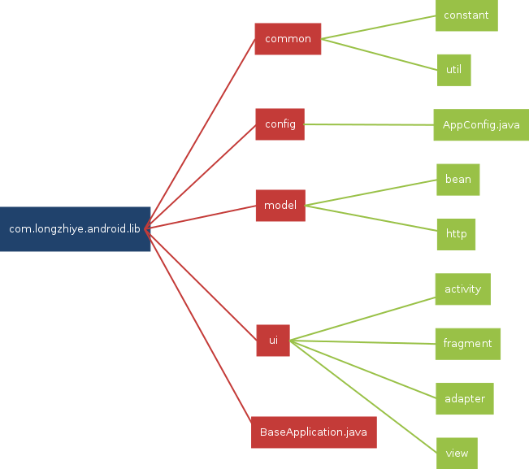

# LibLongzhiye

Android开发框架，在使用的过程中如发现有任何不足，请提交到GitHub或者通过longzhiye163@163.com联系我

## 当前版本

2.0

## 更新日志

1. 重构代码，更换为MVP架构
1. 网络框架更换为OkHttp3+Gson+Glide
1. 添加Android 6.0权限管理
1. 全面支持RecyclerView

### 项目结构图



## 运行须知
- moudle为两部分组成，liblongzhiye为开发框架，app为开发框架的domo

- 使用时，将liblongzhiye导入到你自己的项目路径中，导入即可

```groovy
  compile project(':liblongzhiye')
```

- 在项目中自定义Application继承BaseApplication

- com.longzhiye.android.lib.config.AppConfig配置文件可根据自己的项目进行相应的修改，详情请看源码或者API文档

## 后记
- 项目持续更新，敬请期待

## 欢迎关注我的博客
[博客地址](http://longzhiye.net)
